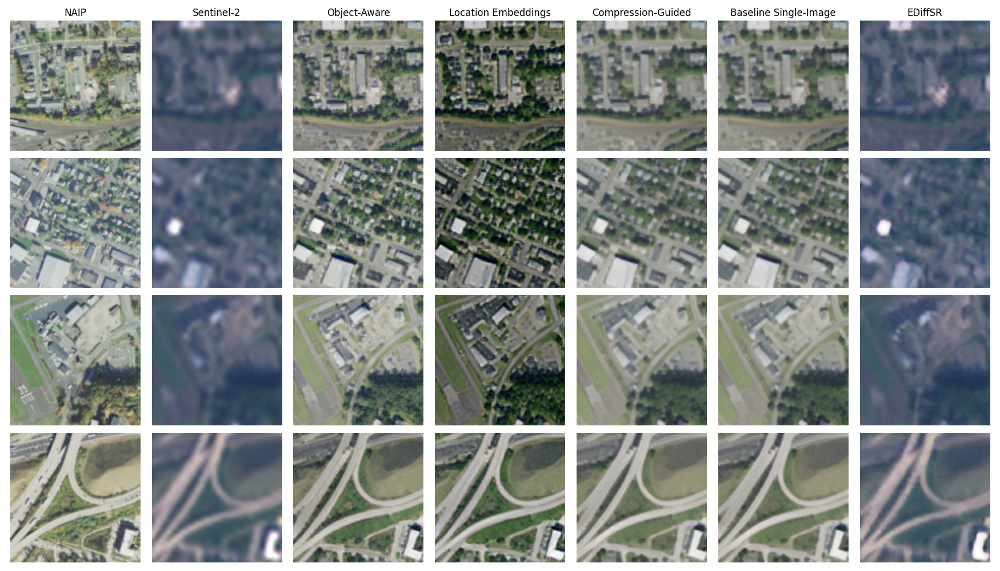
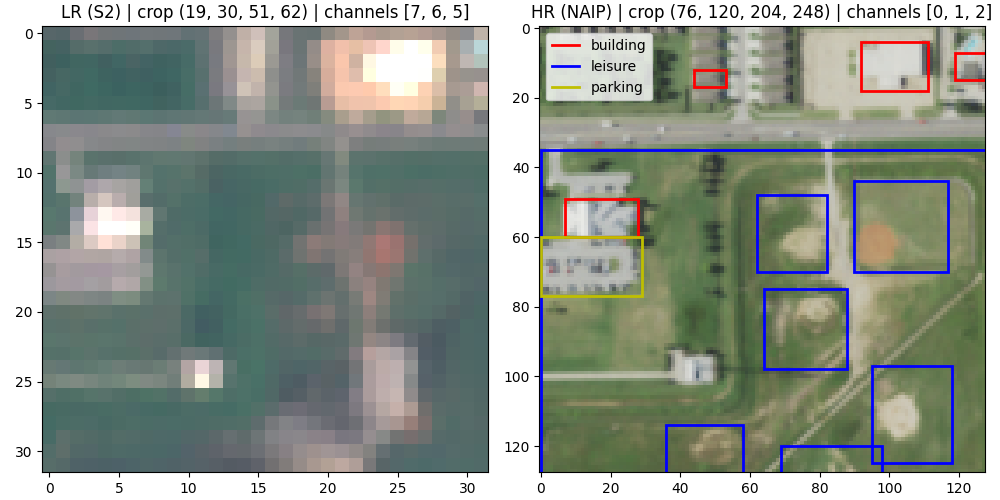
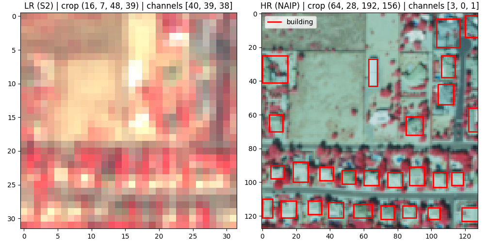
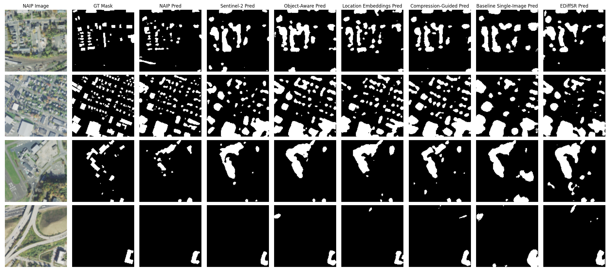

# Deep Learning-Based Framework for High-Resolution Mosaic Generation and Efficient Image Compression of Satellite Data
Original README from the Satlas project: [[link]](satlas_README.md)

Thesis manuscript: [To be published]

|  |
|:---------------------------------------------------------:| 
|       *Fig.1: Output examples for compared models.*       |

## Demos
- Super-resolved images for Innopolis ROI: [To be published]
- Super-resolved images for Stanford ROI: [To be published]

## Dataset
|                                                                    |
|:---------------------------------------------------------------------------------------------------------:| 
| *Fig.2: Example input during training including RGB channels & OSM masks for object-aware discriminator.* |

|                                                                          |
|:---------------------------------------------------------------------------------------------------------------:| 
| *Fig.3: Example input during training including NIR, R, G channels & OSM masks for object-aware discriminator.* |

This project uses a subsample of the latest version of [S2-NAIP dataset](https://huggingface.co/datasets/allenai/s2-naip). 
The prepared subsample is published on Kaggle: [[link]](https://www.kaggle.com/datasets/evgeniyivankin/s2-naip-5k-pairs-rgb-nir).

## Model checkpoints
Checkpoints trained during this project:
- Single-image ESRGAN with object-aware discriminator and CLIPLoss: [To be published].
- Single-image ESRGAN with location embeddings, object-aware discriminator and CLIPLoss: [To be published].
- Single-image ESRGAN with compression guidance (Bpp loss), object-aware discriminator and CLIPLoss: [To be published].

Checkpoints from other projects:
- Satlas [baselines](https://github.com/allenai/satlas-super-resolution?tab=readme-ov-file#esrgan) (only L1Loss + PerceptualLoss + GANLoss) for single (esrgan_1S2) and 8 LR images (esrgan_8S2).
- EDiffSR checkpoint: [[link]](https://github.com/XY-boy/EDiffSR/blob/main/experiments/sisr/ediffsr/180000_G.pth).
- SGDM checkpoint for x32 upscale without map data: [[link]](https://github.com/wwangcece/SGDM?tab=readme-ov-file#dnapretrained-models).

## Experiments with segmentation
<!-- TODO: tables -->
|                                                            |
|:--------------------------------------------------------------------------------------------------------------------:| 
| *Fig.4: Unet++ buildings mask predictions on different inputs including NAIP, Sentinel-2 and super-resolved images.* |

See [`./segmentation`](segmentation) folder for implementation details.

## Experiments with tile seams
<!-- TODO: figures -->
<!-- TODO: tables -->

See the Jupyter notebook for implementation details: [[link]](notebooks/seaming_artifacts.ipynb).

## Key changes compared to Satlas-SR
- Added support for the new version of S2-NAIP: multichannel images, tile filtering by WorldCover, masks & boxes extraction from OSM. 
- Changed the inference pipeline: support overlap, different tile & grid sizes, tile blending.
- Implemented a new architecture with location embeddings proposed by [Panangian & Bittner](https://arxiv.org/abs/2501.15847).
- Added config & code for [EDiffSR](https://github.com/XY-boy/EDiffSR/).
- Added code for segmentation experiments: model training, visualization, evaluation.
- Added code for tile seaming experiments: visualization, evaluation.
- Added code for inference on custom region of interest: downloading Sentinel-2 imagery for the selected region, splitting into tiles.