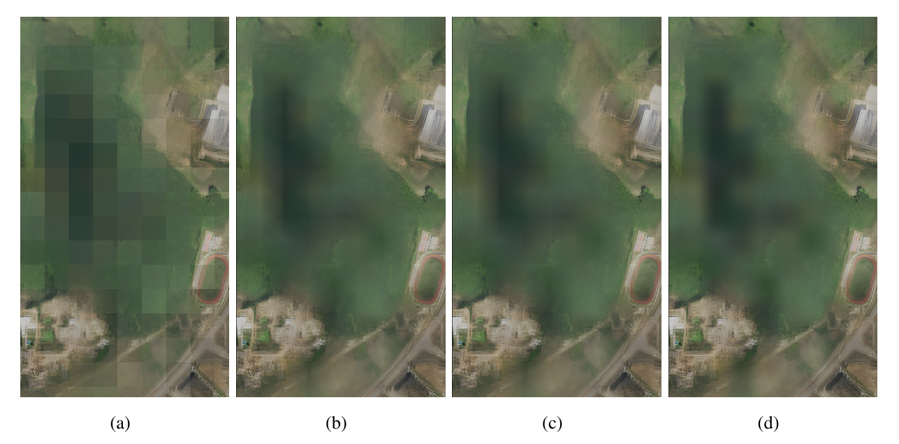

# Deep Learning-Based Framework for High-Resolution Mosaic Generation and Efficient Image Compression of Satellite Data

Original README from the Satlas project: [[link]](satlas_README.md)

Thesis manuscript: [To be published]

|  |
|:---------------------------------------------------------:| 
|      *Fig. 1: Output examples for compared models.*       |

## Demos

- Super-resolved images for Innopolis ROI: [To be published]
- Super-resolved images for Stanford ROI: [To be published]

## Dataset

|                                                                     |
|:----------------------------------------------------------------------------------------------------------:| 
| *Fig. 2: Example input during training including RGB channels & OSM masks for object-aware discriminator.* |

|                                                                           |
|:----------------------------------------------------------------------------------------------------------------:| 
| *Fig. 3: Example input during training including NIR, R, G channels & OSM masks for object-aware discriminator.* |

This project uses a subsample of the latest version
of [S2-NAIP dataset](https://huggingface.co/datasets/allenai/s2-naip).
The prepared subsample is published on
Kaggle: [[link]](https://www.kaggle.com/datasets/evgeniyivankin/s2-naip-5k-pairs-rgb-nir).

## Model checkpoints

Checkpoints trained during this project:

- Single-image ESRGAN with object-aware discriminator and CLIPLoss: [To be published].
- Single-image ESRGAN with location embeddings, object-aware discriminator and
  CLIPLoss: [To be published].
- Single-image ESRGAN with compression guidance (Bpp loss), object-aware discriminator and
  CLIPLoss: [To be published].

Checkpoints from other projects:

- Satlas [baselines](https://github.com/allenai/satlas-super-resolution?tab=readme-ov-file#esrgan) (
  only L1Loss + PerceptualLoss + GANLoss) for single (esrgan_1S2) and 8 LR images (esrgan_8S2).
- EDiffSR
  checkpoint: [[link]](https://github.com/XY-boy/EDiffSR/blob/main/experiments/sisr/ediffsr/180000_G.pth).
- SGDM checkpoint for x32 upscale without map
  data: [[link]](https://github.com/wwangcece/SGDM?tab=readme-ov-file#dnapretrained-models).

### Performance comparison

| Model                        | PSNR $\uparrow$         | SSIM $\uparrow$         | cPSNR $\uparrow$        | LPIPS $\downarrow$      | CLIPScore $\uparrow$   |
|------------------------------|:-----------------------:|:-----------------------:|:-----------------------:|:----------------------:|:----------------------:|
| Object-Aware                 |      17.2286            | 🥈 **0.3850**           |      18.7187            | 🥇 **0.3463**           | 🥇 **0.9498**           |
| Location Embeddings          |      15.1291            |      0.3567             |      18.3820            |      0.3644             |      0.9405             |
| Bpp-Guided                   | 🥇 **17.6989**           | 🥇 **0.4204**           | 🥇 **19.6198**           | 🥈 **0.3555**           |      0.9397             |
| Baseline (esrgan\_1S2)       |      13.2063            |      0.1965             |      15.5893            |      0.4529             |      0.9270             |
| EDiffSR                      |      15.1559            |      0.3241             | 🥈 **19.1176**           |      0.5445             |      0.8619             |
| 🥇 = best, 🥈 = second-best per column. |

## Experiments with segmentation

### DeepLabV3+

| Train Input                                                                                                                    | Inference Input | IoU (%)                                         | F1 (%)                                          | Acc. (%)                                        | Prec. (%)                                       | Recall (%)                                      |
|--------------------------------------------------------------------------------------------------------------------------------|-----------------|-------------------------------------------------|-------------------------------------------------|-------------------------------------------------|-------------------------------------------------|-------------------------------------------------|
| NAIP                                                                                                                           | NAIP            | 🥇 **32.94**                                    | 🥇 **49.56**                                    | 85.99                                           | 41.29                                           | 🥈 **61.98**                                    |
| Sentinel-2                                                                                                                     | Sentinel-2      | 28.56                                           | 44.44                                           | 87.27                                           | 43.12                                           | 45.84                                           |
| Object-Aware                                                                                                                   | Object-Aware    | 31.20                                           | 47.56                                           | 🥈 **87.34**                                    | 🥈 **44.04**                                    | 51.68                                           |
| Location Embed.                                                                                                                | Location Embed. | 🥈 **31.93**                                    | 🥈 **48.40**                                    | 🥇 **87.85**                                    | 🥇 **45.80**                                    | 51.32                                           |
| Bpp-Guided                                                                                                                     | Bpp-Guided      | 27.43                                           | 43.05                                           | 79.17                                           | 30.91                                           | 🥇 **70.88**                                    |
| Baseline SR                                                                                                                    | Baseline SR     | 23.43                                           | 37.97                                           | 85.07                                           | 35.25                                           | 41.14                                           |
| EDiffSR                                                                                                                        | EDiffSR         | 31.13                                           | 47.48                                           | 86.24                                           | 41.21                                           | 56.00                                           |
| NAIP                                                                                                                           | Object-Aware    | 28.25                                           | 44.06                                           | 86.40                                           | 40.54                                           | 48.24                                           |
| NAIP                                                                                                                           | Location Embed. | 27.08                                           | 42.62                                           | 86.76                                           | 41.09                                           | 44.28                                           |
| 🥇 = best, 🥈 = second-best per column. |

### Unet++

| Train Input                                                                                                                    | Inference Input | IoU (%)                                         | F1 (%)                                          | Acc. (%)                                        | Prec. (%)                                       | Recall (%)                                      |
|--------------------------------------------------------------------------------------------------------------------------------|-----------------|-------------------------------------------------|-------------------------------------------------|-------------------------------------------------|-------------------------------------------------|-------------------------------------------------|
| NAIP                                                                                                                           | NAIP            | 🥇 **38.60**                                    | 🥇 **55.70**                                    | 🥇 **89.97**                                    | 🥇 **54.67**                                    | 56.78                                           |
| Sentinel-2                                                                                                                     | Sentinel-2      | 33.25                                           | 49.90                                           | 87.73                                           | 44.48                                           | 56.84                                           |
| Object-Aware                                                                                                                   | Object-Aware    | 33.67                                           | 50.38                                           | 85.93                                           | 41.41                                           | 64.32                                           |
| Location Embed.                                                                                                                | Location Embed. | 🥈 **35.24**                                    | 🥈 **52.11**                                    | 88.13                                           | 47.21                                           | 58.15                                           |
| Bpp-Guided                                                                                                                     | Bpp-Guided      | 33.08                                           | 49.71                                           | 83.93                                           | 38.09                                           | 🥈 **71.52**                                    |
| Baseline SR                                                                                                                    | Baseline SR     | 23.71                                           | 38.34                                           | 73.48                                           | 25.84                                           | 🥇 **74.23**                                    |
| EDiffSR                                                                                                                        | EDiffSR         | 30.75                                           | 47.03                                           | 82.49                                           | 35.41                                           | 70.01                                           |
| NAIP                                                                                                                           | Object-Aware    | 29.77                                           | 45.88                                           | 🥈 **88.89**                                    | 🥈 **49.99**                                    | 42.40                                           |
| NAIP                                                                                                                           | Location Embed. | 22.16                                           | 36.27                                           | 88.69                                           | 48.48                                           | 28.98                                           |
| 🥇 = best, 🥈 = second-best per column. |

|                                                             |
|:---------------------------------------------------------------------------------------------------------------------:| 
| *Fig. 4: Unet++ buildings mask predictions on different inputs including NAIP, Sentinel-2 and super-resolved images.* |

See [`./segmentation`](segmentation) folder for implementation details.

## Experiments with tile seams

### Tile blending

|                                                                                                       |
|:------------------------------------------------------------------------------------------------------------------------------------------------------------:| 
| *Fig. 5: Visual comparison of different pixel weighting strategies: (a) Simple Average (equal weights), (b) Linear (triangular filter), (c) Sine, (b) Hann.* |

See the Jupyter notebook for implementation details: [[link]](notebooks/seaming_artifacts.ipynb).

## Key changes compared to Satlas-SR

- Added support for the new version of S2-NAIP: multichannel images, tile filtering by WorldCover,
  masks & boxes extraction from OSM.
- Changed the inference pipeline: support overlap, different tile & grid sizes, tile blending.
- Implemented a new architecture with location embeddings proposed
  by [Panangian & Bittner](https://arxiv.org/abs/2501.15847).
- Added config & code for [EDiffSR](https
